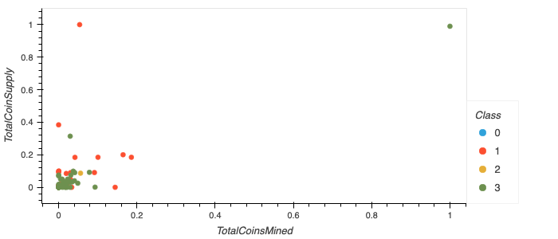

# Cryptocurrencies
Cryptocurrencies project

Sources: 

[Dataset](https://min-api.cryptocompare.com/data/all/coinlist)

Reference:

[hvPlot: Table](https://hvplot.holoviz.org/reference/pandas/table.html#table)

[plotly.express.scatter_3d](https://plotly.com/python-api-reference/generated/plotly.express.scatter_3d.html#plotly-express-scatter-3d)

[sklearn.preprocessing.MinMaxScaler](https://scikit-learn.org/stable/modules/generated/sklearn.preprocessing.MinMaxScaler.html#sklearn.preprocessing.MinMaxScaler.fit_transform)

[Pandas.DataFrame.rename](https://pandas.pydata.org/docs/reference/api/pandas.DataFrame.rename.html)

Output:

